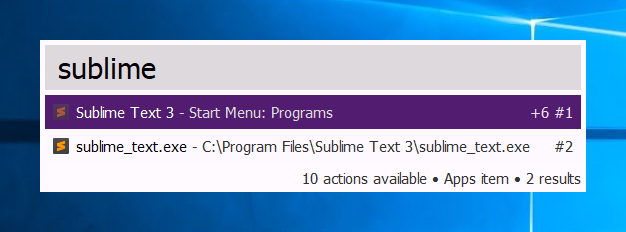
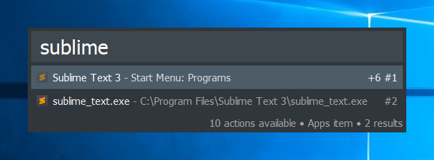
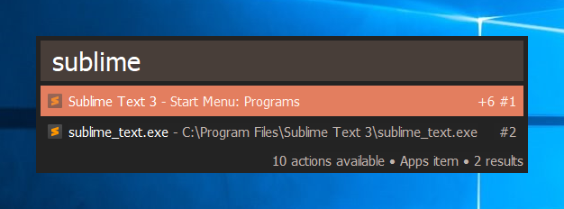
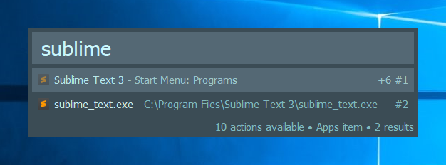

# MyKeypirinhaThemes

## My collection of Keypirinha themes.

### Currently I have 4 themes available in 2 variants (normal .and compact)

1) AlfredDefault

|  |  |
| :-: | :-: |
| AlfredDefault | AlfredDefault-Compact |

2) DarkMojave

|  |  |
| :-: | :-: |
| DarkMojave | DarkMojave-Compact |

3) Dext

|  |  |
| :-: | :-: |
| Dext | Dext-Compact |

4) Novad

|  |  |
| :-: | :-: |
| Novad | Novad-Compact |

## Usage

- Select your theme.
- Open it inside your editor.
- Copy all of its content.
- Paste that at the end of your `Keypirinha.ini` file.
- In `gui` section in config file, set `theme = [SELECTED THEME FILE NAME]`.
    - e.g. `theme = AlfredDefault-Compact` for `AlfredDefault-Compact` theme.
- Save the config file and let `Keypirinha` reload.
- Eat your breakfast and sleep all day long.
- Have fun. 👍

## Contribute

Do you want to contribute? Submit themes, pull requests or issues? Feel free to do so! There's an **MIT License** l👀king at you.
